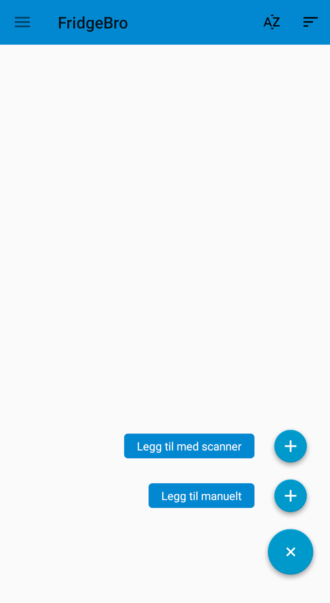

# FridgeBro

## Notice 

This app was made as a college project back in 2018 for the course [Android-programmering](https://www.hiof.no/studier/emner/it/2018/host/itf21013.html). It is to considered abandoned and will never be maintained, nor developed further. If you are looking for something similar I recommend looking into hosting [Grocy](https://github.com/grocy/grocy) and using [grocy-android](https://github.com/patzly/grocy-android).

The app is not fully featured either.

## What is FridgeBro?

FridgeBro is an app for managing the groceries in your fridge. It integrates with [NorgesGruppens' undocumented API](https://github.com/okanten/norgesgruppen-api-wrapper) (don't do the queries client-side if you want to keep your API private) to look up groceries, and will notify you when the expiry date is near. Can also be used as a grocery list

### Key features

* Search through all of NorgesGruppens items
	- Pulls image, price and EAN
* Barcode scanner to speed up adding process
* Grocery list
	- Can directly import to fridge later
* Swipe to delete

## Screenshots

